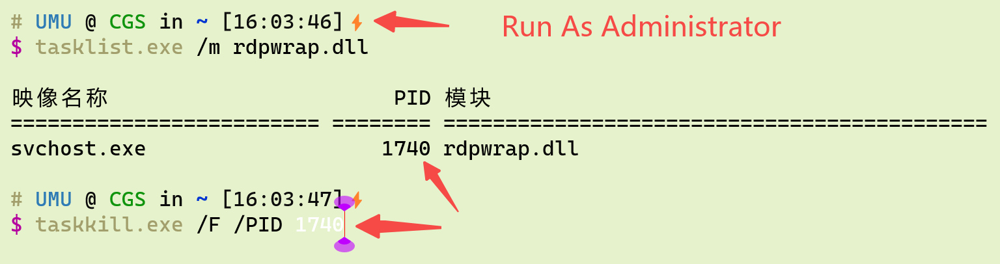

# rdpwrap.ini

Only for Windows 11 x64.

1. Open Powershell as Administrators

2. Kill TermService

3. Download https://raw.githubusercontent.com/UMU618/rdpwrap.ini/main/rdpwrap.ini and replace your old rdpwrap.ini.

4. Start-Service TermService
